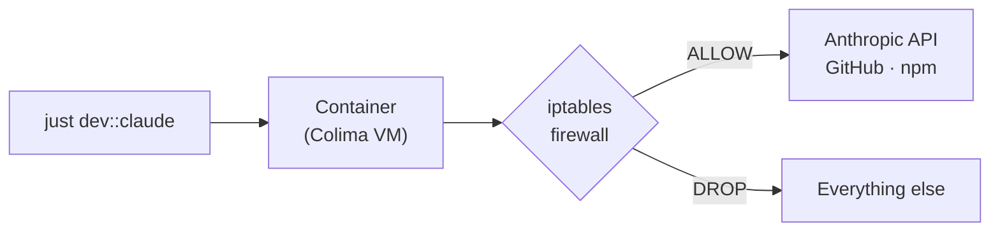
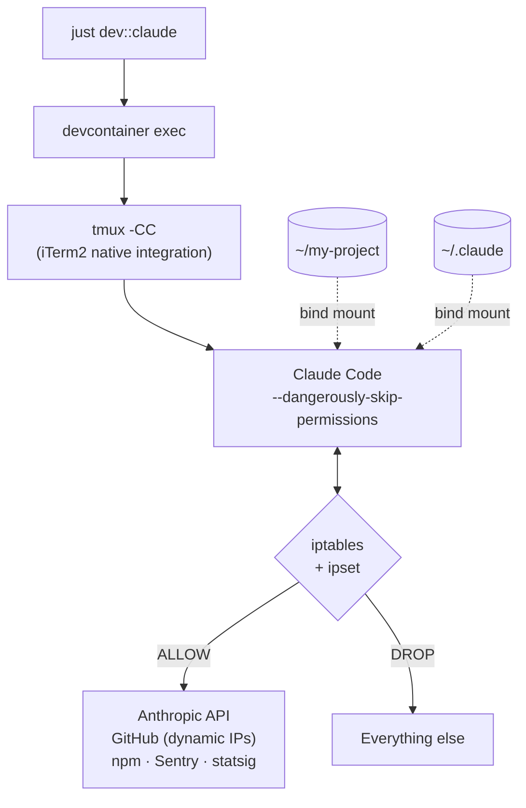

<div align="center">

# :chicken: Free-Range Claude

**Run Claude Code autonomously inside a firewalled container.**<br>
**Skip permission prompts safely.**

[](LICENSE)
[](https://docs.anthropic.com/en/docs/claude-code)
[](https://github.com/abiosoft/colima)
[](https://www.docker.com/)
[](#)

<sub>Autonomous Claude Code, penned up just enough to keep it out of trouble.</sub>

</div>

---

## The problem

Claude Code's `--dangerously-skip-permissions` flag lets you run it unattended, but on bare metal that's genuinely dangerous -- a prompt injection or hallucination could delete files or exfiltrate data. The safe version: run Claude Code inside a container with a network firewall that blocks everything except the services it actually needs.



## The stack

This is opinionated and not sorry about it:

- **macOS** with [Colima](https://github.com/abiosoft/colima) (Docker runtime, uses Apple Virtualization.framework)
- **[iTerm2](https://iterm2.com/)** with tmux -CC for native terminal integration
- **[just](https://github.com/casey/just)** as the task runner
- **zsh** as the shell

If you want something different, fork it and customize it -- with Claude Code itself.

## Quick start

```bash
# Install (one-time)
curl -fsSL https://raw.githubusercontent.com/dbbz/free-range-claude/main/install.sh | bash

# Set up a project
claude-devcontainer-init ~/my-project

# Launch
cd ~/my-project
just dev::claude
```

## Install

```bash
curl -fsSL https://raw.githubusercontent.com/dbbz/free-range-claude/main/install.sh | bash
```

This clones the template to `~/.config/claude-devcontainer`, installs prerequisites (docker CLI, colima, devcontainer CLI, just), builds the sandbox image, and makes `claude-devcontainer-init` available in your shell.

To use a different base image (e.g. for a Python-heavy setup):

```bash
BASE_IMAGE=python:3.13-bookworm ~/.config/claude-devcontainer/install.sh
```

<details>
<summary>Manual install (offline / forked repos)</summary>

```bash
git clone https://github.com/dbbz/free-range-claude ~/.config/claude-devcontainer
~/.config/claude-devcontainer/install.sh
```

</details>

### iTerm2 setup

Open iTerm2 Preferences and configure the tmux profile:

**Profiles > tmux > Window > Style: Maximized**

This makes Claude sessions open full-screen instead of a small default window.

### How the iTerm2 integration works

`just dev::claude` opens a new iTerm2 window powered by tmux in [control mode](https://iterm2.com/documentation-tmux-integration.html) (`tmux -CC`). tmux is invisible -- you get native iTerm2 tabs, scrolling, and selection, but everything runs inside the container.

- **Tab title** = your project folder name, so you always know which sandbox you're looking at.
- **Tab color** = a deterministic color derived from the project name. Different projects get different colors; the same project always gets the same color. No configuration needed.
- **`Cmd+T`** opens a new tab with a fresh, parallel Claude Code session -- still inside the same sandbox, sharing the same project files and firewall.
- **`Cmd+W`** closes a single session. When the last tab closes, the iTerm2 window goes away (the container keeps running in the background).

In practice, you run `just dev::claude` once, and from there you live in iTerm2: `Cmd+T` to spin up more agents, `Cmd+W` to dismiss finished ones. Everything stays sandboxed.

## Usage

### Set up a project

```bash
claude-devcontainer-init ~/my-project
```

The wizard asks three questions:
1. Extra runtimes? (Python, Rust, Go -- auto-adds their package registries to the firewall)
2. Extra allowed hosts? (domains, IPs, or CIDR ranges for the firewall)
3. Static /etc/hosts entries? (for Tailscale peers or internal services without public DNS)

It generates a `.devcontainer/` directory and adds one line to your justfile.

### Day-to-day

```bash
just dev::claude             # launch Claude Code (starts sandbox automatically)
just dev::claude -p "prompt" # with a specific prompt
just dev::exec cargo test    # run any command inside
just dev::exec zsh           # interactive shell inside the sandbox
just dev::status             # container & firewall health at a glance
just dev::logs               # tail container logs
just dev::down               # tear down the container
just dev::rebuild            # rebuild image (cached) + restart
just dev::doctor             # verify and repair: tools, colima, image
just dev::playwright-on      # enable the Playwright MCP server for this project
just dev::playwright-off     # disable it
```

### Browser automation (Playwright MCP)

The sandbox image bundles [`@playwright/mcp`](https://github.com/microsoft/playwright-mcp) and a headless Chromium so Claude Code can drive a browser without reaching outside the firewall. It's off by default -- enable it per-project with `just dev::playwright-on`, then restart Claude.

## How it works



On container startup, `init-firewall.sh` configures iptables:

- **Default policy**: DROP all outbound
- **Allowed**: Anthropic API, GitHub (IPs fetched dynamically), npm, Sentry, statsig, VS Code marketplace
- **Always allowed**: DNS (UDP 53), SSH (port 22), localhost, Docker host network
- **Extensible**: `EXTRA_ALLOWED_HOSTS` env var for project-specific domains, IPs, or CIDR ranges
- **Self-verifying**: blocks `example.com`, confirms `api.github.com` reachable. Fails to start if either check fails.

## What's mounted

| Host | Container | Persists across rebuild? |
|------|-----------|------------------------|
| Project directory | `/workspaces/<project>` | Yes (your files) |
| `~/.claude` | `/home/node/.claude` + `$HOME/.claude` | Yes (your files) |
| `claude-history` volume | `/commandhistory` | Yes (Docker volume) |

The dual `~/.claude` mount exists because Claude Code stores absolute paths in config files. The host path (`/Users/you/.claude/...`) and the container path (`/home/node/.claude/...`) both need to resolve to the same data.

## What it does NOT protect against

- Access to anything mounted into the container (your project files, `~/.claude` tokens)
- Communication with allowlisted hosts (Claude API, GitHub)
- Reading any file in the workspace

This is defense-in-depth, not absolute isolation. Use it with repositories you trust.

## Files

| File | Purpose |
|------|---------|
| `Dockerfile` | Base image: Node.js 20 + Claude Code + zsh + tmux + firewall tools |
| `init-firewall.sh` | iptables firewall, runs on container startup |
| `tmux-claude.conf` | tmux config: every new window = new Claude session |
| `claude-launch.sh` | Launcher: sets iTerm2 tab color per project, then execs claude |
| `dev.just` | Template just module, symlinked into each project's `.devcontainer/` |
| `init.sh` | Per-project wizard (also available as `claude-devcontainer-init`) |
| `install.sh` | One-time machine setup (supports `curl \| bash`) |
| `project-readme.md` | Template README, copied into each project's `.devcontainer/` |

## Updating

```bash
cd ~/.config/claude-devcontainer
git pull
just dev::rebuild   # from any project -- rebuilds the shared image + restarts
```

Each project's `.devcontainer/dev.just` is a symlink to the template, so recipe changes apply immediately -- no per-project update step.

## First-time auth

On first launch inside the container, Claude Code will ask you to log in. This is normal -- macOS stores tokens in Keychain, but the container (Linux) uses file-based tokens. You only need to do this once. The token is saved to `~/.claude` on your host via the bind mount and persists across container rebuilds.

## Acknowledgments

Thanks to [@zeapo](https://github.com/zeapo) for the original idea.

## License

[MIT](LICENSE)
